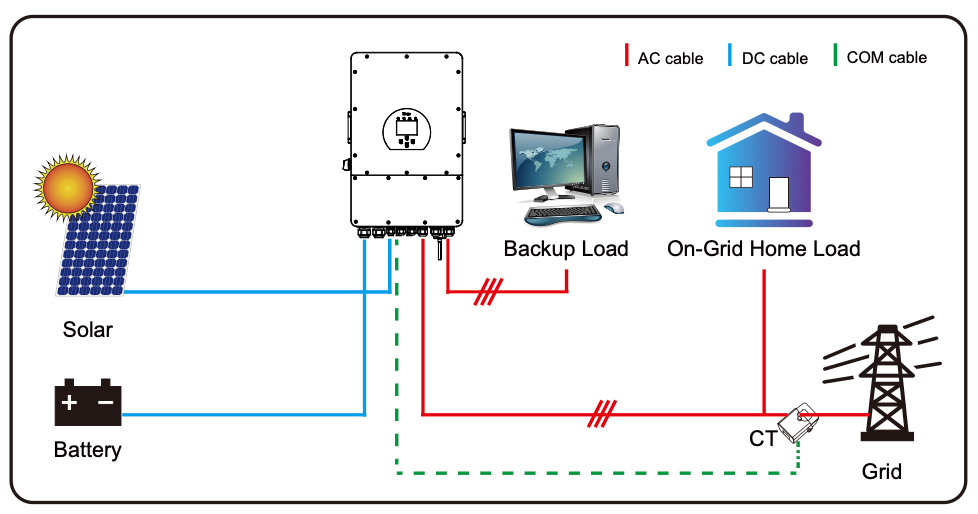

# Deye Inverter Setup Modes

This document describes the different physical setup configurations for Deye hybrid inverters, focusing on how various components are connected to achieve different system architectures.

## Overview

Deye hybrid inverters support multiple setup modes depending on how PV panels, batteries, loads, and additional equipment are connected to the various ports. Each setup mode serves different use cases and has specific configuration requirements.

## Connection Ports Reference

- **PV Inputs**: DC solar panel connections (PV1, PV2)
- **GRID Port**: AC connection to utility grid and main home loads
- **LOAD Port**: AC output for backup/essential loads (UPS function)
- **GEN Port**: AC input/output for generators or additional equipment
- **Battery**: DC connection for battery storage system

## Setup Modes

### 1. Basic Setup

**Configuration:**

- ✅ Battery connected to battery port
- ✅ PV panels connected to PV inputs (PV1/PV2)
- ✅ Home loads connected to GRID-side
- ✅ Backup loads connected to LOAD port
- ❌ GEN port not used

**Description:**
The most common residential setup for hybrid solar systems. Provides solar generation, battery storage, and backup power for essential loads during grid outages.

**Use Cases:**

- Standard residential solar + battery installation
- Essential load backup during power outages
- Grid-tie with battery storage for self-consumption
- Time-of-use optimization

**Advantages:**

- Simple installation and configuration
- Cost-effective solution
- Reliable backup power for critical loads
- Maximum solar self-consumption

---

### 2. Generator Setup

**Configuration:**

- ✅ Battery connected to battery port
- ✅ PV panels connected to PV inputs (PV1/PV2)
- ✅ Home loads connected to GRID-side
- ✅ Backup loads connected to LOAD port
- ✅ Generator connected to GEN port

**Description:**
Extends the Basic setup with generator backup capability. The generator can charge batteries and power loads when both solar and grid are unavailable.

**Use Cases:**

- Areas with unreliable grid supply
- Critical applications requiring extended backup time
- Remote locations with occasional grid access
- Systems requiring multiple backup power sources

**Advantages:**

- Extended backup duration beyond battery capacity
- Generator can charge batteries when solar is insufficient
- Multiple backup power sources for maximum reliability
- Automatic generator control capabilities

**Considerations:**

- Requires generator with compatible voltage/frequency
- Generator start/stop control configuration needed
- Fuel availability and maintenance requirements

---

### 3. Smart-Load Setup

**Configuration:**

- ✅ Battery connected to battery port
- ✅ PV panels connected to PV inputs (PV1/PV2)
- ✅ Home loads connected to GRID-side
- ✅ Backup loads connected to LOAD port
- ✅ Non-essential loads connected to GEN port

**Description:**
Uses the GEN port as a controllable output for non-essential loads. The inverter can manage these loads based on available solar power, battery state, or time schedules.

**Use Cases:**

- Load shedding during peak tariff periods
- Surplus solar power utilization (hot water, pool pumps)
- Demand response programs
- Energy management optimization

**Advantages:**

- Intelligent load management capabilities
- Maximizes solar self-consumption
- Reduces peak demand charges
- Flexible energy scheduling

**Examples of Non-Essential Loads:**

- Hot water heaters
- Pool pumps and filtration
- Air conditioning (secondary zones)
- Electric vehicle charging
- Industrial heating elements

---

### 4. AC Couple Setup

**Configuration:**

- ✅ Battery connected to battery port
- ✅ PV panels connected to PV inputs (PV1/PV2)
- ✅ Home loads connected to GRID-side
- ✅ Backup loads connected to LOAD port
- ✅ PV microinverter connected to GEN port

**Description:**
Combines DC-coupled solar (PV inputs) with AC-coupled solar (microinverter on GEN port). Allows integration of existing AC solar systems or expansion beyond DC input capacity.

**Use Cases:**

- Retrofitting existing microinverter systems
- Expanding solar capacity beyond DC input limits
- Mixed technology installations (string + micro)
- Systems with shading or complex roof layouts

**Advantages:**

- Maximizes total solar capacity
- Utilizes existing AC solar investments
- Flexible panel orientation and technology mixing
- Backup power can include AC-coupled solar

**Considerations:**

- AC-coupled solar only available during grid connection
- Additional complexity in system monitoring
- Potential for frequency regulation conflicts

---

### 5. AC-Solar Setup

**Configuration:**

- ✅ Battery connected to battery port
- ❌ PV panels NOT connected to PV inputs
- ✅ Home loads connected to GRID-side
- ✅ Backup loads connected to LOAD port
- ✅ PV microinverter connected to GEN port

**Description:**
Pure AC-coupled solar system where all PV generation comes through microinverters connected to the GEN port. No DC-coupled solar panels used.

**Use Cases:**

- Retrofitting existing microinverter-only installations
- Buildings with complex electrical layouts
- Systems where DC wiring is impractical
- Maximizing use of existing AC solar infrastructure

**Advantages:**

- No DC wiring required for solar
- Can utilize existing microinverter systems
- Simplified solar installation in some cases
- Panel-level optimization and monitoring

**Limitations:**

- AC-coupled solar not available during grid outages
- Lower overall system efficiency
- Limited backup solar generation capability
- Dependency on grid for solar production

## Configuration Considerations

### Grid Code Compliance

Each setup mode must comply with local grid connection standards. Some considerations:

- Generator setups may require additional protection settings
- AC-coupled systems need frequency regulation coordination
- Smart-load configurations require load control compliance

### Safety Requirements

- Proper isolation between grid, generator, and backup circuits
- Emergency shutdown procedures for each configuration
- Grounding and protection device coordination

### Monitoring and Control

- Different setup modes require specific monitoring configurations
- Load control strategies vary by setup type
- Battery management adapts to available charging sources

## Choosing the Right Setup Mode

| Priority          | Recommended Setup | Key Benefits                             |
| ----------------- | ----------------- | ---------------------------------------- |
| Simplicity        | Basic             | Easy installation, reliable operation    |
| Maximum Backup    | Generator         | Extended runtime, multiple power sources |
| Energy Management | Smart-Load        | Optimized consumption, load control      |
| System Expansion  | AC Couple         | Increased capacity, retrofit capability  |
| AC Solar Only     | AC Couple2        | Existing system integration              |

## Next Steps

1. Choose appropriate setup mode based on requirements
2. Review grid compliance requirements for your region
3. Configure inverter settings for selected setup mode
4. Test system operation in all scenarios
5. Document configuration for future reference

---

*This document should be used in conjunction with region-specific grid configuration files and inverter operation mode settings.*
